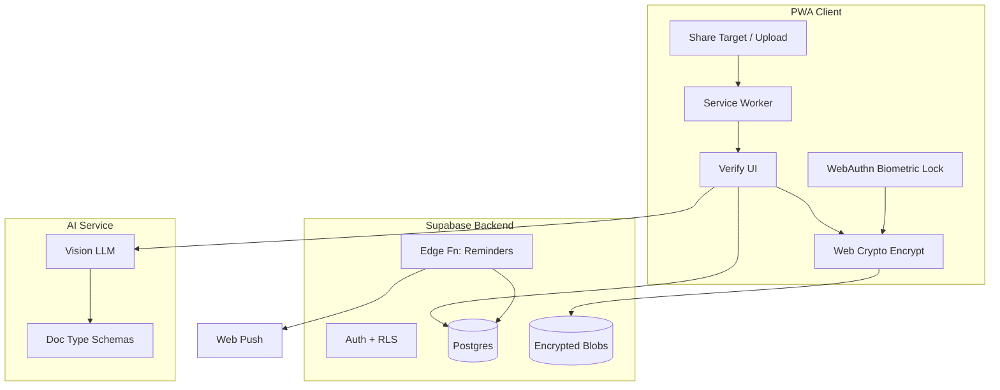
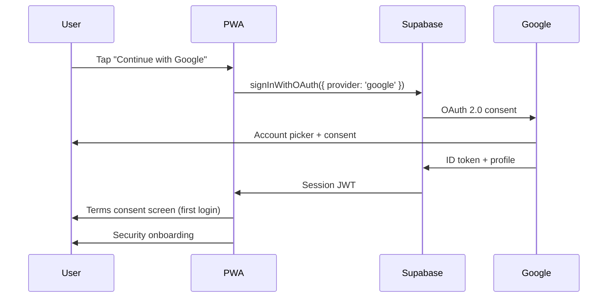
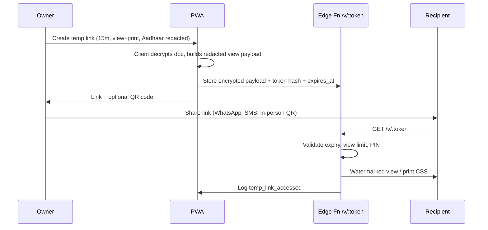

# Dox — Document Vault PWA Plan

## Vision

A mobile-first PWA where Indian families store critical documents, get AI-assisted data entry, verify once, and never miss a renewal. Upload via **Share to Dox** from any app on the phone.

---

## Market research (June 2026)

### Global / general competitors

| Product | Model | Strengths | Gaps for India |
|---------|-------|-----------|----------------|
| [DocStow](https://www.docstow.com/) | PWA + freemium | AI extraction, expiry reminders, family sharing, installable PWA | NZ-focused doc types; not India-specific |
| [Travel Document Vault](https://traveldocumentvault.com/) | Native iOS/Android | MRZ passport scan, biometric lock, family profiles, 6-month early alerts | Native only; travel-centric; no share-target PWA |
| [MyDok](https://mydok.app/) | Web + mobile | Expiry alerts, cloud sync, sharing | Generic; limited India doc templates |
| [ExpiryKeeper](https://expirykeeper.com/) | SaaS | Team/family workspaces, custom reminder days | Not a document vault; tracker only |
| [DocuReminder](https://play.google.com/store/apps/details?id=com.docureminder) | Android native | RC/PUC/insurance focus, offline, biometric | Android-only; manual entry; no AI |

### India-specific competitors

| Product | Focus | Strengths | Gaps |
|---------|-------|-----------|------|
| [Sanchay](https://sanchay.app/) | Insurance + health vault | Indian insurance types, family, encrypted storage, NRI | Web app; no share-target; limited AI extraction |
| [AstraVault](https://astravault.co.in/) | Secure vault India | Devanagari OCR, PAN detection, biometric + passphrase, AES-256 | Native Android; no PWA share intake |
| Zoop Wallet / DigiLocker integrations | Verified gov IDs | Official verified docs | Import-only; not a family expiry system |

### Market opportunity

1. **No dominant India-first PWA** combining share-to-app intake, AI extraction for Indian doc types, verify step, family sharing, and biometric lock.
2. **Vehicle + insurance pain** is acute in India (RC, PUC, DL fines) — DocuReminder proves demand but lacks AI and cross-platform PWA.
3. **Trust gap** — users want encryption + local biometrics; AstraVault and Sanchay lead on privacy messaging.
4. **PWA share target** is production-ready on **Android Chrome** (installed PWA); iOS still needs in-app upload fallback ([MDN share_target](https://developer.mozilla.org/en-US/docs/Web/Progressive_web_apps/Manifest/Reference/share_target)).
5. **AI extraction** is table stakes globally (DocStow); India needs Hindi/Devanagari + regional doc layouts.

### Target user

- Primary: Urban Indian families (25–45) managing docs for self, spouse, parents, kids.
- Secondary: NRIs tracking Indian insurance/policies remotely.
- Jobs-to-be-done: "Share this policy PDF and remind me before renewal", "Show spouse's passport number at airport", "Don't let RC/PUC expire."

### Positioning

> **Dox** — Share any document. AI fills the details. You verify once. Never miss an expiry.

Privacy-first, India-first templates, family-ready. Not a DigiLocker replacement — a **household expiry-aware vault**.

**Marketing line (India):** Share a document. We'll remind you before it expires. Your family stays in the loop.

---

## UX & navigation

### App shell — two tabs + profile

```text
┌─────────────────────────────────────┐
│  Dox                    [Avatar]    │  ← Profile → Settings live here
├─────────────────────────────────────┤
│  ⚠ 2 expiring this month  (banner)  │  ← tap → filtered expiry list
├─────────────────────────────────────┤
│                                     │
│         (tab content)               │
│                                     │
├─────────────────────────────────────┤
│   Family          Assets            │  ← bottom nav; Family = default
└─────────────────────────────────────┘
```

| Area | Route | Purpose |
|------|-------|---------|
| **Family** (default) | `/` | People-first: each member card → their docs, expiry status, quick-copy |
| **Assets** | `/assets` | Non-person docs: vehicles, property, rental, warranties |
| **Profile** | `/profile` | User info, household owner, link to **Settings** |
| **Settings** | `/profile/settings` | Nested under profile — not a top-level tab |

**Why two tabs:** Indian households think in people (passport, Aadhaar, insurance) and things (car RC, house papers). Splitting reduces clutter vs one long list.

### Family tab (default home)

- **Expiring soon banner** at top (next 30 days across household)
- Member cards: avatar, name, relationship, doc count, nearest expiry chip (e.g. "Passport in 12 days")
- Tap member → their documents + **quick-copy** row (passport no, PAN — masked until unlock)
- FAB: Add member | Add document (assign to member)
- Empty state: "Add yourself and family" + contact picker shortcut (Android)

### Assets tab

Documents and records **not tied to identity docs** — vehicles, property, **purchases & warranties**, household bills.

| Asset type | Examples | Grouping |
|------------|----------|----------|
| **Vehicle** | RC, PUC, DL copy, vehicle insurance | Bundle by reg number (e.g. "Swift — MH01AB1234") |
| **Property** | Rental agreement, society NOC, property tax | By address label |
| **Purchase** | MacBook invoice, TV bill, AC warranty, appliance receipt | One card per product (e.g. "MacBook Pro 14") |
| **Subscription** | Broadband, OTT, AMC contract | By service name |

**Vehicle bundle card:** "2 of 3 valid" (RC ✓, PUC ⚠, Insurance ✓).

**Purchase card:** product name, **₹ amount**, purchase date, **warranty until**, store name + tap-to-call — invoice PDF and warranty doc attached underneath.

- FAB: Add asset → pick type → upload or scan bill
- Filter: expiring warranties | by person | by store
- Optional **tag to person** — "Rahul's MacBook" shows on Family member profile too

### Profile & Settings

**Profile** (`/profile`): Google avatar, name, email, plan badge, household name.

**Settings** (inside profile):

| Section | Items |
|---------|-------|
| **Account** | Plan, sign out |
| **Appearance** | Light / Dark / System; subtle theme (see Design) |
| **Reminders** | Push + **email** toggles; default offsets (90/30/7) |
| **Security** | Security Center, app lock, active sessions, activity log |
| **Privacy** | Download data, delete account, grievance |
| **Help** | Install guide, Share-to-Dox tutorial, recovery code |

No third tab for Settings — keeps bottom nav to two items only.

### Onboarding flow

1. Google sign-in + ToS/Privacy
2. Security onboarding (3 bullets)
3. **Install PWA** prompt (Android) / Add to Home Screen (iOS)
4. **Share tutorial** — "Try sharing an image to Dox" with demo animation
5. Add first family member (self) → optional first upload
6. Optional: generate **recovery code** (store offline)

---

## Design system

### Principles

- Calm, trustworthy, not "fintech loud"
- Mobile-first; 44px min touch targets
- **Subtle colours** — low saturation, soft contrast; expiry states use muted amber/rose, not alarm red

### Theme — light & dark

| Token | Light | Dark |
|-------|-------|------|
| Background | `#F8F9FA` (warm gray) | `#121416` |
| Surface / card | `#FFFFFF` | `#1C1F23` |
| Border | `#E8EAED` | `#2A2E33` |
| Text primary | `#1A1D21` | `#E8EAED` |
| Text muted | `#6B7280` | `#9CA3AF` |
| Accent (primary CTA) | `#4A7C6F` (muted sage) | `#6BA392` |
| Accent hover | `#3D6B5F` | `#7BB5A3` |
| Warning (expiring) | `#B8860B` (muted gold) | `#D4A84B` |
| Danger (expired) | `#C45C5C` (dusty rose) | `#E07A7A` |
| Success | `#5A8F6E` | `#6BA382` |

- **Dark mode:** supported from Phase 0; default **System**; persist in `localStorage` + profile pref
- Tailwind CSS variables in `src/styles/theme.css`; shadcn/ui tokens mapped to palette
- No pure `#000` / `#FFF` backgrounds — reduces eye strain
- Document thumbnails: subtle `ring-1 ring-border` in both modes

### Typography

- **Font:** Inter or system-ui stack (fast PWA load)
- Headings: semibold; body: regular; labels: medium, muted colour

---

## Simple v1 scope (advisor review)

Build **simple defaults**; hide power features behind "More options."

| Ship in v1 | Default / simple mode | Defer or v1.1 |
|------------|----------------------|---------------|
| Family + Assets tabs | As designed | — |
| Expiring banner on Family home | 30-day window | Custom windows (Pro) |
| **Quick-copy** fields | Passport, PAN, policy no, reg no | — |
| **Email reminders** | On by default with push | — |
| **Vehicle bundle** | RC + PUC + Insurance grouped | — |
| **Purchase & warranty** | Invoice + amount + store + warranty expiry | Tag to family member |
| **Duplicate detection** | Warn on matching reg no / serial / doc type | — |
| **Notes** per document | Free text field | — |
| **Mark as renewed** | Snooze + prompt re-upload | — |
| **Recovery code** | Optional at setup | — |
| Temp share | **1 hr + QR + redacted ID** | PIN, 7-day, print (v1.1) |
| Family roles | **Owner + viewer** | admin / edit roles |
| AI doc types | **RC, Insurance, Passport** first | PAN, Aadhaar after legal |
| Encryption | Server AES + TLS for MVP | Client E2E Pro (Phase 5+) |
| Activity log | Household feed in Security Center | Per-doc tab export |
| Reminder offsets | 90 / 30 / 7 fixed | Custom per doc (Pro) |

### High-value features (added to plan)

| Feature | Value | Implementation notes |
|---------|-------|---------------------|
| **Quick-copy** | Airport, bank, hospital — copy ID in 2 taps | Masked until biometric unlock; log `copied_field` (no value) |
| **Email reminders** | iOS PWA push unreliable | Resend; same schedule as push; user toggles in Settings |
| **Vehicle bundle** | #1 India pain (fines) | `asset_id` groups RC/PUC/insurance; card shows validity fraction |
| **Duplicate detection** | Prevents vault clutter | Hash reg no / policy no on save; confirm Replace or Keep both |
| **Document notes** | "Renewed at Andheri RTO" | `notes` text column; no AI |
| **Mark as renewed** | Closes reminder loop | Sets `renewed_at`, clears expiry nudge, optional new upload |
| **Recovery code** | Lost phone trust | 12-word or 8-block code at setup; re-wraps vault key; show once |
| **Share tutorial** | Share Target discovery | Onboarding step + Help in Settings |
| **Expiring banner** | Drives return visits | Query next 30 days; tap → list |
| **Purchase records** | Warranty claims, resale proof | AI from invoice; store contact one tap |

---

## Product requirements

### Must-have (MVP)

- [ ] Installable PWA (manifest, SW, icons)
- [ ] **Google Sign-In** — primary auth via Supabase OAuth; verified email for identity
- [ ] **Terms of Service + Privacy Policy** — standalone consent at signup (DPDP-compliant)
- [ ] **Security Center** — visible encryption status, data location, lock state
- [ ] **Web Share Target** — receive images/PDFs from Android share sheet (installed PWA)
- [ ] Manual upload fallback (camera, file picker) for iOS and desktop
- [ ] **Optional AI extraction** — user toggles on/off at upload; default on for Pro, off for Free
- [ ] AI document classification (type detection) — only when opted in
- [ ] AI field extraction with confidence scores — only when opted in
- [ ] **Verify & confirm UI** — edit before save; required when AI used; manual entry path when skipped
- [ ] Encrypted document storage
- [ ] **Delete document** — permanent delete with confirmation; purges blob, metadata, reminders, shares
- [ ] Expiry date extraction + reminder scheduling
- [ ] Push notifications (Web Push) + **email reminder fallback**
- [ ] **Two-tab navigation** — Family (default) + Assets; Settings under Profile
- [ ] **Expiring soon banner** on Family home (30-day window)
- [ ] **Dark mode** — Light / Dark / System; subtle palette (see Design system)
- [ ] Document list + search + filter by type/expiry status
- [ ] **Per-document activity log** — upload, view, share, revoke, delete, temp link (no content)
- [ ] **Quick-copy** — masked fields; unlock to copy (passport, PAN, policy, reg no)
- [ ] **Duplicate detection** on upload — warn if same reg no / doc type exists
- [ ] **Notes** per document (free text)
- [ ] **Mark as renewed** — dismiss reminder; optional re-upload
- [ ] **Recovery code** — optional vault recovery at setup
- [ ] **Onboarding** — install PWA + Share-to-Dox tutorial

### Should-have (v1)

- [ ] Family household — add members by **name, email, phone**; contact-picker on Android
- [ ] Family invite flow — email/SMS link; pending → accepted states
- [ ] **Disable family member** — suspend household access; retain profile; revoke all grants
- [ ] **Revoke access** — per-document or bulk revoke for a member
- [ ] Family roles: **owner + viewer** (simple v1)
- [ ] Selective document sharing within household
- [ ] **Assets tab** — vehicles, property, **purchases/warranties**; vehicle bundle; purchase cards
- [ ] **Temporary share links** — default 1 hr + QR + redacted ID; advanced options in "More"
- [ ] **Biometric app lock** (WebAuthn passkey unlock)
- [ ] Snooze reminders
- [ ] Multi-page documents (passport data page + photo page) → v1.1
- [ ] Export/share single doc as PDF → v1.1
- [ ] **Digital Visiting Card** — QR + share sheet + optional NFC (see § Visiting Card); Pro

### Could-have (later → see Potential Ideas)

- DigiLocker import
- On-device OCR (privacy mode)
- Hindi UI
- WhatsApp reminder bot
- Enterprise / small business compliance mode

---

## Architecture



### Share Target flow (Android)

1. User shares PDF/image from WhatsApp/Gallery → selects **Dox** (installed PWA).
2. OS POSTs `multipart/form-data` to `/share-target`.
3. Service worker intercepts, stores file in Cache/IndexedDB, redirects to `/import?ref=...`.
4. App page loads file → **upload options screen** (AI on/off) → extraction or store-only → verify UI if AI used.

Manifest snippet:

```json
{
  "share_target": {
    "action": "/share-target",
    "method": "POST",
    "enctype": "multipart/form-data",
    "params": {
      "title": "title",
      "text": "text",
      "files": [{
        "name": "documents",
        "accept": ["image/*", "application/pdf", ".pdf", ".jpg", ".jpeg", ".png", ".webp"]
      }]
    }
  }
}
```

### Upload options — optional AI extraction

Before processing, user sees an **upload options** screen:

| Option | Behavior |
|--------|----------|
| **Use AI extraction** (default Pro) | Send to vision model → classify → extract → verify UI |
| **Store only** (default Free) | Encrypt and save file; manual metadata entry later |
| **Extract later** | Save file now; "Run AI" button on document detail |

**UI copy:** "AI reads your document to fill expiry dates and details. You review before saving. Turn off to store the file only."

**Privacy:** AI notice shown only when toggle is on. No image leaves device until user confirms.

**Share Target default:** Remember last choice per user (`localStorage` + profile pref).

### Extraction strategy — on-device first, cloud AI optional

**Recommendation: hybrid, not either/or.** Lead with on-device for trust and cost; offer cloud vision AI only when on-device confidence is low or user opts in for complex Indian identity docs.

| Approach | Best for | Pros | Cons |
|----------|----------|------|------|
| **Manual entry** | Any doc; privacy-max users | Zero cost; no data leaves device; always works | User effort |
| **On-device OCR** | Purchase receipts, printed invoices, clear English bills | Private; offline; no API cost | Weak on Devanagari, RC/passport layouts, WhatsApp-compressed photos |
| **Cloud vision AI** | RC, passport, insurance, Aadhaar (post-legal) | High accuracy on varied layouts; classify + extract in one step | ~$0.004/doc; image sent to provider; needs consent + DPA |

#### Do you *need* cloud AI?

| Doc type | On-device enough? | Cloud AI needed? |
|----------|-------------------|------------------|
| Mac invoice, store bill | **Yes** — amount, date, store are printed clearly | Optional boost |
| Vehicle RC, insurance PDF | Partial — OCR gets text; parsing is hard | **Yes** for good UX |
| Passport, Aadhaar, PAN | Poor on-device for Indian formats | **Yes** if you promise auto-fill |
| User stores file only | N/A | **No** |

**For Dox's wedge:** Share + **expiry reminders** does not require AI. AI reduces typing — it is not the core loop.

#### Default behaviour (recommended)

```
Upload
  → On-device OCR attempt (WASM: Tesseract / RapidOCR)
  → Confidence high? → Pre-fill verify screen (no cloud)
  → Confidence low? → Offer: "Enter manually" | "Use cloud AI (Pro)" 
  → User always verifies before save
```

| Tier | Extraction |
|------|------------|
| **Free** | Manual + on-device OCR only; no cloud |
| **Pro** | On-device first; cloud AI when user toggles on or accepts upgrade prompt |

#### On-device stack (planned)

- **Runtime:** ONNX Runtime Web or Tesseract.js in PWA (lazy-loaded ~5–15 MB model)
- **Scope v1:** English + numeric extraction for `purchase_receipt` (amount, date, phone regex, GSTIN)
- **Defer:** Devanagari on-device → cloud or manual until WASM models mature
- **Privacy mode** (Settings): disable cloud AI entirely; on-device + manual only

#### Cloud AI — when to use

- User explicitly toggles **Use cloud AI** on upload
- Or taps **Improve extraction** after weak on-device result
- Never runs without consent notice; never on by default for Aadhaar until legal sign-off

#### Build order

1. **Phase 1–2:** Manual fields + store-only (no AI) — validates vault, assets, reminders
2. **Phase 2b:** On-device OCR for purchase receipts
3. **Phase 2c:** Cloud vision AI for RC, Insurance, Passport (Pro, opt-in)
4. **Later:** On-device classification model if WASM accuracy improves

**Bottom line:** Stick to **on-device as default** for trust and margins. Keep **cloud AI as optional Pro feature** for identity docs where accuracy matters — not required for MVP beta.

### AI extraction pipeline (cloud — when opted in)

1. **Classify** — vision model returns doc type + confidence.
2. **Extract** — type-specific JSON schema (Zod-validated).
3. **Normalize** — dates → ISO; mask Aadhaar display (XXXX-XXXX-1234).
4. **Present** — verify screen; low-confidence fields highlighted.
5. **Persist** — only after user taps Confirm.

Example schema (RC):

```typescript
{
  docType: "vehicle_rc",
  fields: {
    registrationNumber: string,
    ownerName: string,
    vehicleClass: string,
    registrationDate: string,
    expiryDate: string | null,
    insurer: string | null,
    policyNumber: string | null
  },
  confidence: Record<string, number>
}
```

Example schema (purchase receipt / invoice):

```typescript
{
  docType: "purchase_receipt",
  fields: {
    productName: string,           // "MacBook Pro 14\" M3"
    brand: string | null,          // "Apple"
    serialNumber: string | null,
    purchaseDate: string,          // ISO date
    amount: number,
    currency: "INR",
    storeName: string,             // "Imagine Apple Premium Reseller"
    storePhone: string | null,
    storeEmail: string | null,
    storeAddress: string | null,
    warrantyUntil: string | null,  // from invoice or warranty card
    warrantyTerms: string | null // "1 year standard; AppleCare until 2028"
  },
  confidence: Record<string, number>
}
```

### Purchase & warranty records

**Job to be done:** "I bought a Mac — scan the bill once; amount, store, warranty, and contact are always findable."

#### One purchase card = everything in one place

```
Purchase asset: "MacBook Pro 14"
  ├── Owned by: Rahul (optional FamilyMember link)
  ├── Product: name, brand, serial no
  ├── Money: amount (₹), purchase date
  ├── Store: name, phone, email, address  ← tap-to-call / Maps
  ├── Warranty: valid until, terms text
  ├── Documents: invoice PDF, warranty card, extended AMC
  └── Reminders: warranty expiry (90/30/7 days)
```

#### User flow

1. Share invoice photo from gallery → Dox → assign **Purchase** asset (new or existing).
2. AI on → extracts amount, date, store, product; user verifies.
3. Optionally tag **owned by** family member (e.g. Rahul's laptop).
4. Add warranty PDF later → attach to same purchase card.
5. Warranty nears expiry → push/email reminder; **Mark as renewed** if extended.

#### Store contact UX

On purchase detail:

| Field | Action |
|-------|--------|
| Store phone | Tap → `tel:` |
| Store email | Tap → `mailto:` |
| Address | Tap → open Maps |
| Amount | Display ₹ formatted; optional GST line if on invoice |

Reuse store details when adding another purchase from same shop (suggest "Imagine — Andheri" from history).

#### AI doc types (purchase)

Add **`purchase_receipt`** and **`warranty_card`** to extraction schemas (Phase 2 or 2b).

- Invoice: amount, date, store, product, GSTIN optional
- Warranty card: warranty end date, terms, serial match

Free tier: manual entry; Pro: AI extraction.

#### Data model update

```
Asset (type: vehicle | property | purchase | subscription)
  ├── label                    // "MacBook Pro 14"
  ├── purchase_fields (JSON)   // when type=purchase
  │     ├── product_name, brand, serial_number
  │     ├── amount, currency, purchase_date
  │     ├── store_name, store_phone, store_email, store_address
  │     └── warranty_until, warranty_terms
  ├── owned_by_member_id       // optional — tag to person
  └── reg_number               // vehicles only

Document → linked to asset_id; kinds: invoice | warranty | amc | other
```

Purchase appears under **Assets tab** and on **Family member** profile when `owned_by_member_id` is set.

### Reminder engine

- Default offsets: 90, 60, 30, 7 days before expiry (custom per doc → Pro v1.1).
- Delivery: **Web Push** + **email fallback** (Resend); user enables either/both in Settings → Reminders.
- **Mark as renewed:** user taps from reminder or doc detail → sets `renewed_at`, stops nudges, prompts optional re-upload.
- Post-expiry weekly nudge until renewed or dismissed.
- Cron via Supabase Edge Function + `pg_cron` or external scheduler.

### Authentication — Google Sign-In

Primary auth: **Google OAuth** via Supabase Auth. Google verifies identity; Dox stores only `sub`, email, name, avatar URL.



**Supabase setup:**
- Enable Google provider in Auth → Providers
- OAuth client in Google Cloud Console (Web + redirect URI)
- Scopes: `openid email profile` only — no Gmail/Drive access
- Optional: link passkey after Google login for biometric vault lock

**Why Google first:** Low friction on Android; verified email for family invites; no password management.

Fallback (Phase 5+): email magic link for users without Google.

### Family members — contacts, email, name

Users add family **without requiring them to upload docs first**. Two paths:

| Path | Flow |
|------|------|
| **Manual entry** | Name, email, phone (+91), relationship (spouse, parent, child, other) |
| **Contact picker** | Android `navigator.contacts.select()` (PWA, permission-gated) pre-fills name/email/phone |

**Data model:**

```
Household
  ├── owner_user_id (Google auth)
  ├── FamilyMember (profile — may or may not have Dox account)
  │     ├── display_name, email, phone_e164
  │     ├── relationship, date_of_birth (optional)
  │     ├── linked_user_id (null until invite accepted)
  │     └── avatar_url
  ├── Invite (email or phone, token, expires_at, status)
  └── Document → linked to FamilyMember
```

**Invite flow:**
1. Owner adds member (name + email or phone).
2. Dox sends invite email/SMS: "Join [Household] on Dox."
3. Recipient signs in with Google → auto-links `linked_user_id`.
4. RLS grants access to shared documents only.

**Phone usage:** OTP invite link or WhatsApp deep link (future). Store phone only with explicit consent (DPDP purpose: family invite + emergency contact for document access).

**Contact API note:** `navigator.contacts` works on Android Chrome; iOS Safari lacks it — manual entry required.

### Family sharing model

```
Household (1 owner)
  ├── FamilyMember (name, email, phone, relationship, status: active | disabled | pending)
  ├── Member role (owner | viewer) — simple v1
  ├── Asset (type: vehicle | property | purchase | subscription, label, owned_by_member_id optional)
  ├── Document (owner_member_id OR asset_id, encrypted_blob_id, notes, deleted_at)
  ├── ShareGrant (document_id, member_id, permission: view, revoked_at)
  ├── TempShareLink (document_id, token_hash, expires_at, scope, purpose)
  └── DocumentActivity (document_id, event_type, actor_id, metadata_json, created_at)
```

RLS: members only see docs they own or are granted.

### Document lifecycle — delete, revoke, disable

| Action | Who | Effect |
|--------|-----|--------|
| **Delete document** | Owner (or admin) | Confirm dialog → purge Storage blob, metadata, reminders, ShareGrants, active TempLinks; append `deleted` to activity log (retain log row 1 yr) |
| **Revoke access** | Owner | Remove ShareGrant for one doc + one member; member loses view immediately; logged |
| **Revoke all for member** | Owner | Bulk revoke all ShareGrants for a member; optional disable |
| **Disable family member** | Owner | Set `status: disabled`; revoke all grants; block new invites; member cannot sign in to household; profile + their owned docs retained |
| **Re-enable member** | Owner | Set `status: active`; re-invite or restore grants manually |

**Delete confirmation:** "Permanently delete [Passport — Rahul]? This cannot be undone." + type doc name or biometric confirm for sensitive docs.

**DPDP erasure:** Delete is hard delete from Storage + Postgres; activity log retains event metadata (actor, timestamp, action) without document content.

### Document activity log

Per-document timeline at `/documents/:id/activity` and household summary in Security Center.

| Event | Logged fields (no PII content) |
|-------|-------------------------------|
| `uploaded` | actor, timestamp, source (share/manual), ai_used |
| `verified` | actor, fields_confirmed_count |
| `viewed` | actor or temp_link_id, device_type |
| `shared` | actor, target (member_id or link) |
| `revoked` | actor, target_member_id |
| `temp_link_created` | actor, expires_at, scope, purpose |
| `temp_link_accessed` | link_id, ip_country (not full IP), view_count |
| `temp_link_revoked` | actor |
| `deleted` | actor |
| `reminder_sent` | offset_days |

Retention: **1 year** (DPDP Rules 2025). Export available in Settings → Privacy.

### Temporary access — controlled share for print & ID verification

**Use cases:** Show passport at hotel check-in, PAN at bank counter, print RC for RTO — without giving permanent vault access or WhatsApping an unredacted photo.

#### How it works



#### Link options (owner chooses at creation)

| Setting | Choices |
|---------|---------|
| **Duration** | 15 min, 1 hr, 24 hr, 7 days (Pro) |
| **Purpose** | View on screen, Print-friendly, ID fields only |
| **Scope** | Full document, Selected fields, Image only (no extracted text) |
| **Protection** | Optional 4-digit PIN; single-use (invalidates after 1 view) |
| **Redaction** | Aadhaar/PAN auto-masked in "ID fields" mode; owner warned if overriding |

#### Technical model

```
TempShareLink
  ├── id, document_id, created_by
  ├── token_hash (SHA-256 of random 32-byte token; raw token in URL only)
  ├── expires_at, max_views, view_count
  ├── purpose: view | print | id_fields
  ├── scope_json (which fields visible)
  ├── pin_hash (optional)
  ├── status: active | expired | revoked
  └── payload_ref (encrypted blob or pre-rendered redacted asset)
```

**Recipient URL:** `https://dox.app/v/{token}` — no Dox account required.

**Security controls:**
- Token is unguessable (128-bit entropy); only hash stored server-side
- HTTPS only; `Referrer-Policy: no-referrer`
- Watermark overlay: "Shared by [Name] via Dox — expires [time]"
- Owner can **revoke link** anytime from document detail → "Active links"
- Max **3 active links per document** (Free), **10** (Pro)
- Rate limit: 10 views/min per token
- No search indexing (`robots: noindex`, `X-Robots-Tag`)

**E2E note:** Owner's client decrypts the vault document, applies redaction rules, re-encrypts payload with a link-specific key; key delivered in URL **fragment** (`#k=...`) so it never hits server logs. Server stores ciphertext + metadata only.

**Print mode:** CSS `@media print` layout; optional auto-close tab after print dialog.

**QR for in-person:** Owner shows QR on phone; recipient scans → same `/v/:token` page; ideal for airport/hotel without messaging apps.

**Compliance:** Temp share counts as user-initiated disclosure (DPDP purpose); log retained; Aadhaar redaction default-on per UIDAI rules.

### Biometric lock

- **Unlock app**: WebAuthn `navigator.credentials.get` with `userVerification: 'required'`.
- **Vault key** (stretch): WebAuthn PRF extension → HKDF → AES-GCM DEK unwrap ([PRF guide](https://developers.yubico.com/WebAuthn/Concepts/PRF_Extension/Developers_Guide_to_PRF.html)).
- Fallback: 6-digit PIN or account password.
- Session timeout: lock after 5 min background or on app switch.

### Vault recovery

Google auth restores **account** access; recovery code restores **vault** access on a new device.

1. At setup (optional, skippable): generate **12-word recovery code** or 8-block alphanumeric code.
2. User must store offline (screenshot discouraged; copy to password manager or write down).
3. New device: Google sign-in → "Restore vault" → enter recovery code → re-wrap DEK to new WebAuthn/PIN.
4. Show code **once**; regenerate invalidates old code (logged in activity).

---

## Digital Visiting Card (professionals)

Optional feature for **doctors, consultants, lawyers, CA, real-estate agents** — a digital business card inside Dox, under Profile (not a third tab).

### Platform reality — proximity sharing

| Method | iPhone | Android PWA | Available to Dox? |
|--------|--------|-------------|-------------------|
| **NameDrop / AirDrop** (hold phones together) | Native only | N/A | **No** — not exposed to web apps |
| **QR code** (one shows, other scans) | Camera app | Camera / in-app scanner | **Yes** — primary method |
| **Web Share API** (WhatsApp, SMS, email) | Yes | Yes | **Yes** |
| **vCard download** (.vcf → Add to Contacts) | Yes | Yes | **Yes** |
| **Web NFC** (tap NFC sticker/tag) | No | Chrome Android only | **Partial** — write URL to physical tag |
| **BLE phone-to-phone** | No | Experimental | **No** for v1 |

**UX label:** "Share nearby" = **fullscreen QR** + optional NFC tag write — feels like proximity; not iPhone NameDrop.

### Card content

| Field | Notes |
|-------|-------|
| Name, title, organization | Required |
| Phone, email | Tap-to-call on public page |
| Website / booking link | Practo, Calendly, clinic site |
| Address, specialty, clinic hours | Doctor preset |
| Medical registration no. | Display only; user-verified |
| Photo / logo | Optional |

Templates: **Doctor** | **Business** | **Custom**

### User flows

1. **Enable** — Profile → "My Visiting Card" → fill fields → publish.
2. **Show nearby** — fullscreen QR → `https://dox.app/c/{slug}`; brightness boost.
3. **Scan card** — camera QR → preview → save to phone contacts (vCard).
4. **Share** — `navigator.share()` or download `.vcf`.
5. **NFC (Android)** — write URL to NTAG sticker; tap-to-open for recipients.

### Public page

- `https://dox.app/c/{slug}` — no install required
- **Add to Contacts** → vCard 3.0 download
- Optional PIN (Pro); `noindex` for unlisted cards
- Separate DPDP consent at card setup

### Monetization

- **Pro:** 1 card, custom slug, no Dox branding, view count
- **Free:** not included (or basic card with branding)

### Phase 6 — post-beta (~1 week)

Card editor, public page, QR show/scan, vCard share, Android Web NFC write.

**True NameDrop** → requires native app (see Potential Ideas).

---

## Tech stack detail

| Component | Technology |
|-----------|------------|
| Monorepo | Single repo `dox/` |
| Frontend | React 19, TypeScript, Vite 6, Tailwind, shadcn/ui |
| Design | CSS variables; **light/dark/system**; muted sage accent palette |
| PWA | vite-plugin-pwa, Workbox |
| Backend | Supabase (Auth, Postgres, Storage, Edge Functions) |
| Auth | **Google OAuth** via Supabase Auth; passkey for vault lock |
| ORM | Supabase client + generated types |
| AI | On-device OCR (WASM) default; cloud vision LLM opt-in (Pro) | Privacy-first; cloud only when needed |
| Validation | Zod schemas per doc type |
| Testing | Vitest (unit), Playwright (E2E share flow on Android emulator) |
| CI | GitHub Actions — lint, test, deploy preview |
| Hosting | Vercel/Cloudflare Pages (frontend) + Supabase (backend) |

---

## Terms & Conditions

Legal pages required before public launch. Separate documents (DPDP requires standalone privacy notice).

| Document | Purpose | When shown |
|----------|---------|------------|
| **Terms of Service** | Service use, account rules, liability, governing law (India) | Signup checkbox + `/legal/terms` |
| **Privacy Policy** | What data collected, why, retention, rights, contact | Signup checkbox + `/legal/privacy` |
| **Cookie / local storage notice** | SW, IndexedDB, session tokens | First visit banner |
| **AI processing notice** | Docs sent to AI provider for extraction; not used for training | Before first extraction |
| **Family sharing consent** | Sharing PII with household members | Before first share |

**Signup consent flow (blocking):**

```
[ ] I agree to the Terms of Service
[ ] I agree to the Privacy Policy and consent to processing of my personal data as described
[Continue with Google]  (disabled until both checked)
```

**Key ToS clauses:** acceptable use (no illegal docs), account termination, service availability, limitation of liability, dispute resolution (Indian courts), age 18+.

**Data Principal rights (in-app):** Settings → Privacy → Download my data | Delete account | Withdraw consent | Grievance contact.

**Grievance officer:** Named contact + email on privacy policy (DPDP requirement for Data Fiduciaries).

---

## Security visibility (user-facing)

Users must **see** that their data is protected — not just trust marketing copy.

### Security Center (`/settings/security`)

| Element | What user sees |
|---------|----------------|
| **Vault status** | 🟢 Encrypted — AES-256-GCM |
| **In transit** | 🟢 TLS 1.3 — all connections secured |
| **App lock** | Face ID / fingerprint enabled or "Set up now" |
| **Last unlocked** | Timestamp + device name |
| **Active sessions** | List with revoke option |
| **Data location** | "Stored in India (Mumbai region)" or configured region |
| **Google account** | linked email (masked: s***@gmail.com) |
| **Family access** | Who can see your shared docs |

### Onboarding security screen (first login)

Short, visual checklist:
1. Your documents are encrypted before upload
2. Only you hold the key (with biometric unlock)
3. We cannot read your documents (zero-knowledge for Pro tier)
4. AI reads docs only when you upload — never for training
5. You verify every extracted field before we save it

### Per-document security badge

On document detail: lock icon + "Encrypted" + "Shared with: Spouse" or "Private" + link to **Activity** tab.

### Document activity log (v1)

Document detail → **Activity** tab and Settings → Activity (household-wide):
- "Uploaded via Share", "AI extraction skipped", "Shared with Priya", "Temp link created (1 hr)", "Temp link viewed", "Access revoked", "Deleted"
- No document content or field values in log
- Owner can export CSV (Settings → Privacy)

### Transparency log (v1)

Settings → Security Center → Recent activity: aggregated view of document events + session events.

---

## Compliance — Indian IT Act & data protection

Dox is a **Data Fiduciary** under the **Digital Personal Data Protection Act, 2023** (DPDPA). Legacy **IT Act, 2000** and **SPDI Rules, 2011** still apply in parallel until fully superseded.

### Applicable laws

| Law | Relevance to Dox |
|-----|------------------|
| **DPDP Act 2023 + Rules 2025** | Primary framework — consent, notice, security, breach notification, erasure |
| **IT Act 2000 §43A** | Compensation for failure to protect sensitive personal data |
| **SPDI Rules 2011** | Defines sensitive personal data (passwords, financial, health, **biometric**) |
| **Aadhaar Act 2016 + UIDAI regulations** | Restrictions on Aadhaar number storage, display, sharing |
| **IT Rules 2021** (intermediaries) | Not applicable initially — Dox is not a social media intermediary |

**Compliance deadline:** Full DPDP operational compliance by **May 13, 2027** (18-month phase from Nov 2025). Build compliant from day one.

### DPDP Act — how we apply it

| Obligation | Dox implementation |
|------------|-------------------|
| **Lawful purpose + consent** (§4–7) | Signup consent; purpose-limited processing (vault, reminders, family share) |
| **Notice** (Rules 2025) | Standalone privacy policy; itemized data categories and purposes |
| **Data minimization** (§8) | Store only user-confirmed extracted fields; optional delete source image |
| **Accuracy** (§8) | User verify step before save |
| **Storage limitation** (§8(3)) | Delete on account closure; retention policy documented |
| **Security safeguards** (§8(5)) | Encryption, access controls, RLS, audit logs (1-year minimum per Rules) |
| **Breach notification** | 72-hour process to Data Protection Board + affected users |
| **Children's data** (§9) | 18+ only at signup; parental consent if minors added as family profiles later |
| **Cross-border transfer** (§16) | Prefer India-region hosting; DPA with processors |
| **Data Principal rights** (§11–14) | Access, correction, erasure, grievance — in-app + email |
| **Significant Data Fiduciary** | Unlikely at launch; reassess at 50K+ users (DPO, DPIA, audit) |

### IT Act 2000 §43A + SPDI Rules 2011

Document vaults handle **sensitive personal data**:
- Financial info (insurance policies, bank statements)
- Health info (medical insurance, lab reports)
- Biometric info (if user uploads Aadhaar with photo/fingerprint reference — we do **not** collect biometrics ourselves)

**Required measures (SPDI Rule 5–8):**
- Published privacy policy on website/app
- Consent before collection
- Option to withdraw consent
- Reasonable security practices (ISO 27001 or documented equivalent)
- Grievance officer contact
- Disclosure to third parties only with consent or legal requirement

### Aadhaar-specific rules (critical)

UIDAI regulations prohibit careless Aadhaar handling. Dox approach:

| Rule | Implementation |
|------|----------------|
| Do not publish/display Aadhaar publicly | Mask in UI: `XXXX-XXXX-1234`; never in URLs or logs |
| Redact in any export/share | Black out Aadhaar number on shared PDFs |
| Do not store longer than necessary | User can delete; purge on account deletion |
| No biometric storage | Never store fingerprint/iris — only document image if user uploads |
| Consent at upload | "This document contains Aadhaar. Store encrypted in your vault?" |
| Legal review | Counsel sign-off before marketing Aadhaar support |

**Safer positioning:** "Store your Aadhaar card copy securely" — not Aadhaar authentication or e-KYC.

### Compliance implementation checklist

- [ ] Privacy policy + ToS drafted (legal review)
- [ ] Consent UI at signup (granular, withdrawable)
- [ ] Grievance officer appointed + published
- [ ] Data Processing Agreements with Supabase, AI provider, email vendor
- [ ] India-region Supabase project (ap-south-1 or equivalent)
- [ ] Encryption at rest + in transit documented
- [ ] Access logs retained 1 year
- [ ] Breach response runbook (72-hour notification)
- [ ] Account deletion + data erasure API
- [ ] DPIA document for AI document processing
- [ ] Employee access policy (least privilege)

---

## Cost estimate (infrastructure)

Assumptions for modeling:
- Avg stored doc: **1 MB** (compressed image/PDF)
- Avg docs per active user: **12** (lifecycle); **2 new uploads/month**
- AI extraction: **~$0.004/doc** (GPT-4o classify + extract, 2 calls)
- Supabase **Pro** $25/mo base (100K MAU, 100 GB storage included)
- Frontend: Vercel/Cloudflare **$0–20/mo**
- Email invites: Resend **~$0–20/mo**
- Google OAuth: **included** in Supabase Auth MAU

### Cost by user base

| MAU | Total docs stored | Storage | Supabase | AI/mo | Other | **Total/mo** | **₹/mo** (@₹85/$) | Cost/active user |
|-----|-------------------|---------|----------|-------|-------|--------------|-------------------|------------------|
| 500 | 6,000 | 6 GB | $25 | $4 | $10 | **$39** | ₹3,315 | $0.078 |
| 2,000 | 24,000 | 24 GB | $25 | $16 | $15 | **$56** | ₹4,760 | $0.028 |
| 10,000 | 120,000 | 120 GB | $25 + $0.4¹ | $80 | $25 | **$130** | ₹11,050 | $0.013 |
| 25,000 | 300,000 | 300 GB | $25 + $4.3¹ | $200 | $40 | **$269** | ₹22,865 | $0.011 |
| 50,000 | 600,000 | 600 GB | $25 + $10.7¹ | $400 | $60 | **$496** | ₹42,160 | $0.010 |
| 100,000 | 1,200,000 | 1.2 TB | $25 + $23.5¹ | $800 | $100 | **$949** | ₹80,665 | $0.009 |

¹ Storage overage: (GB − 100) × $0.0213/GB/mo

### Cost by documents uploaded (AI-heavy month)

One-time upload burst (e.g. onboarding 50 docs/family):

| Docs uploaded (month) | AI cost | Storage added | Notes |
|----------------------|---------|---------------|-------|
| 1,000 | $4 | 1 GB | Beta |
| 10,000 | $40 | 10 GB | Launch month |
| 100,000 | $400 | 100 GB | Viral spike — consider rate limits |
| 500,000 | $2,000 | 500 GB | Need batch API (50% off) + queue |

### Revenue vs cost (illustrative)

Assume **5% paid conversion**, mix 60% Pro (₹149) / 40% Family (₹249):

| MAU | Paid users | Revenue/mo | Infra cost | **Gross margin** |
|-----|------------|------------|------------|------------------|
| 2,000 | 100 | ₹17,400 | ₹4,760 | **73%** |
| 10,000 | 500 | ₹87,000 | ₹11,050 | **87%** |
| 50,000 | 2,500 | ₹4,35,000 | ₹42,160 | **90%** |

Free-tier users cost ~$0.01–0.03/mo each (storage + occasional AI). Cap free tier at **10 docs** and **manual entry only** (no AI) to protect margins.

### Cost optimization levers

| Lever | Savings |
|-------|---------|
| Delete source image after verified extraction | 50–70% storage reduction |
| Client-side OCR for text-only docs | Skip AI for clean scans |
| OpenAI Batch API for non-urgent extraction | 50% AI cost |
| Image compression before upload | 40% storage |
| Supabase spend cap + alerts | Prevent surprise bills |

### One-time / annual costs

| Item | Estimate |
|------|----------|
| Legal (ToS, Privacy, DPDP review) | ₹50,000–1,50,000 |
| Google Cloud OAuth setup | ₹0 |
| SSL, domain | ₹2,000/yr |
| Security audit (pre-scale) | ₹1,00,000–3,00,000 |
| DPO consultant (if SDF) | ₹30,000–50,000/mo |

---

## Compliance & privacy (summary)

| Requirement | Implementation |
|-------------|----------------|
| DPDP Act 2023 | Consent at signup, standalone privacy policy, deletion API, India region, grievance officer |
| IT Act §43A / SPDI | Reasonable security, privacy policy, consent, grievance redressal |
| Aadhaar regulations | Mask, redact, no public display, minimal retention, legal review |
| Data minimization | User-confirmed fields only; optional delete raw image |
| Encryption | TLS 1.3 in transit; AES-256-GCM at rest; client-side for Pro |
| AI processing | User-initiated only; no training; DPA with provider |
| Audit logs | 1-year retention per DPDP Rules 2025 |

---

## Monetization (draft)

| Tier | Price | Includes |
|------|-------|----------|
| Free | ₹0 | 10 documents, 1 member, basic reminders, manual upload |
| Pro | ₹149/mo | Unlimited docs, AI extraction, custom reminders, export |
| Family | ₹249/mo | Up to 6 members, sharing, shared dashboard, priority support |

Annual discount ~20%. 14-day trial on paid tiers.

---

## Phased roadmap

### Phase 0 — Foundation (1–2 weeks)

- Scaffold Vite + React + TS + Tailwind + PWA plugin
- **Theme system** — light/dark/system, subtle palette (`src/styles/theme.css`)
- **App shell** — Family + Assets bottom nav; Profile → Settings nested
- Supabase project: auth, `documents`, `households`, `family_members`, `assets` tables, RLS stubs
- **Google OAuth** — Supabase provider + consent-gated signup
- **Terms + Privacy** pages (draft) + signup consent checkboxes
- **Security Center** shell (static status indicators)
- Basic routing, install prompt, empty Family + Assets placeholders
- **Exit criteria**: PWA installs; dark mode works; user signs in with Google after accepting ToS/Privacy

### Phase 1 — Document intake (1–2 weeks)

- Share Target manifest + SW handler
- Manual upload (camera, file picker)
- **Upload options** — AI on/off toggle; store-only path
- Assign doc to **Family member** or **Asset** (vehicle/property)
- Encrypted upload to Supabase Storage
- **Assets tab** — vehicle bundle + **purchase cards** (amount, store, warranty)
- **Duplicate detection** on save
- **Notes** field on document detail
- Document list + **delete document** with confirmation
- **Document activity log** schema + upload/delete events
- **Onboarding** — install + Share-to-Dox tutorial
- **Exit criteria**: Share PDF from Android → assign to vehicle asset; duplicate warning works

### Phase 2 — AI extraction + verify (2 weeks)

- Edge Function: classify + extract (only when user opts in)
- Schemas: **RC, Insurance, Passport** first; **purchase_receipt, warranty_card** in Phase 2b
- Verify UI with confidence highlighting; manual entry when AI skipped
- Save structured metadata to Postgres
- **Quick-copy** row on member doc detail (masked fields)
- **Exit criteria**: Share insurance PDF with AI on → fields pre-filled → quick-copy works after unlock

### Phase 3 — Expiry & reminders (1 week)

- Expiry field parsing + **expiring soon banner** on Family home
- Web Push + **email reminders** (Resend)
- Snooze + **Mark as renewed** flow
- **Exit criteria**: User receives push and email 7 days before test expiry; mark renewed clears nudge

### Phase 4 — Family + biometric lock (2 weeks)

- **Family tab** — member cards, per-person doc list, expiry chips
- Add family members — name, email, phone, relationship; Android contact picker
- Email invite flow + pending/accepted states
- Share grants + **revoke access** (per doc + bulk); **owner + viewer** roles
- **Disable family member**
- **Temporary share links** — default 1 hr + QR + redacted; "More options" for advanced
- WebAuthn registration + lock screen
- **Recovery code** setup in Settings → Security
- Household **activity log** in Security Center
- **Exit criteria**: Family home shows expiring banner; temp link works; recovery code shown once; app locks on reopen

### Phase 5 — Launch prep (1 week)

- Legal review of Terms + Privacy (DPDP, IT Act, Aadhaar)
- Grievance officer published; breach runbook tested
- Landing page with Security Center marketing section
- Play Store TWA optional wrapper
- Beta with 20 households
- **Exit criteria**: Production deploy; 5 beta users complete full flow; compliance checklist 80%+

### Phase 6 — Visiting Card (post-beta, ~1 week)

- Digital Visiting Card editor (doctor + business templates)
- Public card page, QR "Show nearby", scan + vCard share
- Android NFC tag write (optional)
- **Exit criteria**: Professional user shares card via QR; contact saved on recipient phone

**Total estimate**: ~8–10 weeks to beta; +1 week for Visiting Card.

---

## Implementation status (2026-06-18)

MVP PWA built in `src/` — demo mode (local-first). Run `npm run dev`.

| Area | Status |
|------|--------|
| PWA shell + dark mode | Done |
| Family + Assets tabs | Done |
| Upload + on-device OCR mock | Done |
| Purchase + vehicle assets | Done |
| Temp share + visiting card | Done |
| Security Center + PIN lock | Done |
| Supabase + cloud AI | Env-ready, not wired |
| Share Target SW POST | Manifest only; handler TBD |
| Real WebAuthn PRF E2E | Deferred |

---

## Success metrics

| Metric | Target (90 days post-beta) |
|--------|---------------------------|
| PWA installs | 500 |
| Docs uploaded via share | 40% of uploads |
| Verify completion rate | >85% of extractions |
| Reminder action rate | >30% tap-through |
| Family plan conversion | 10% of paid |
| NPS | >40 |

---

## Risks & mitigations

| Risk | Mitigation |
|------|------------|
| iOS no Share Target for files | In-app upload + Shortcuts guide; monitor Safari updates |
| AI extraction errors on Indian docs | Human verify step mandatory; improve schemas iteratively |
| DPDP / Aadhaar legal exposure | Legal review; masking; data minimization |
| WebAuthn PRF not on all devices | PIN fallback; progressive enhancement |
| User trust | Zero-knowledge messaging; transparent privacy policy; optional local-only mode later |
| Visiting card proximity expectations | NameDrop/AirDrop not possible in PWA; market as QR + NFC tag + share sheet |

---

## Potential Ideas

Backlog — implement eventually or remove:

- DigiLocker OAuth import for verified gov docs
- On-device OCR (ONNX / ML Kit WASM) for offline/privacy mode
- Hindi + regional language UI and OCR
- WhatsApp bot for reminder delivery
- TWA wrapper for Google Play listing
- OCR for handwritten dates on old certificates
- Bulk import from Google Drive folder
- Admin dashboard for small businesses (fleet RC/PUC tracking)
- Apple Watch / Wear OS complication for next expiry
- Integration with insurance aggregator APIs for policy sync
- **NameDrop / AirDrop-style exchange** — requires native iOS/Android app (not PWA)
- Visiting card: save scanned cards to Dox CRM / address book sync
