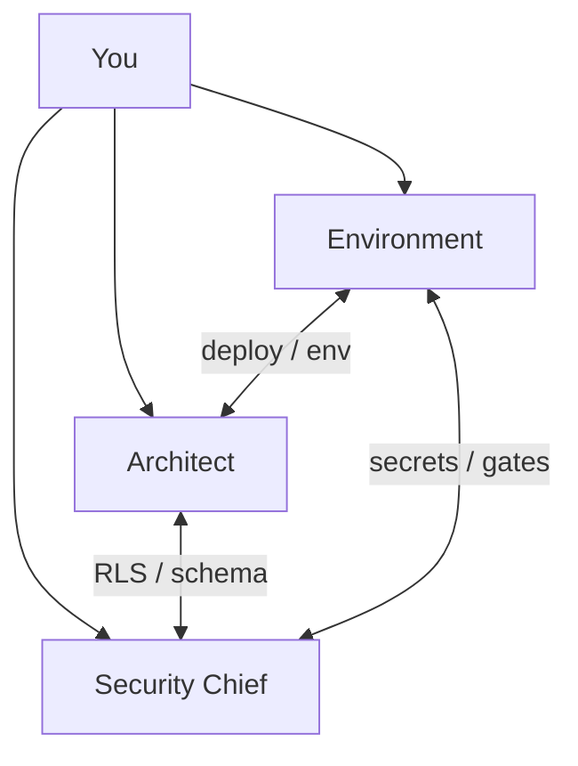
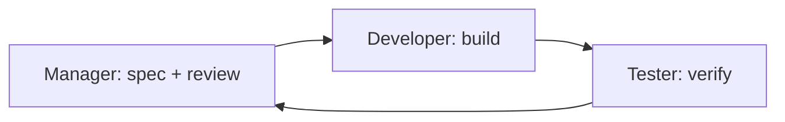

# PreVault Agentic Development Loop

Two layers: **production trio** (parallel) + **feature loop** (sequential).

---

## Production trio (parallel — Dev / UAT / Prod)

Use for architecture, security, releases, and weekend MVP. Invoke with `@` or Task subagents.

| Agent | File | Model (recommended) | Focus |
|-------|------|---------------------|-------|
| **Environment** | `.cursor/agents/environment.md` | Composer | Dev / UAT / Prod, CI gates, deploy, secrets |
| **Architect** | `.cursor/agents/architect.md` | Composer; Opus for schema | Production-grade design, migrations, token-efficient plans |
| **Security Chief** | `.cursor/agents/security-chief.md` | Opus / `security-review` | DPDP, RLS, PII, ask-before new security controls |

**Cross-invocation:** Any production agent may request another by name (e.g. *"Invoke Security Chief before UAT→Prod"*). You can run all three in parallel threads.

**Gap analysis:** [PRODUCTION_MVP_GAP_ANALYSIS.md](./PRODUCTION_MVP_GAP_ANALYSIS.md)  
**Locked architecture decisions:** [architect.md](../.cursor/agents/architect.md) § Locked decisions (2026-06-23)

---

## Feature loop (sequential — each task)

| Agent | File | Output |
|-------|------|--------|
| **Manager** | `.cursor/agents/manager.md` | Task spec, review approval |
| **Developer** | `.cursor/agents/developer.md` | Code, tests |
| **Tester** | `.cursor/agents/tester.md` | Test report, UX feedback |

1. **Manager** reads PLAN.md / TRACK.md → writes task + acceptance criteria.
2. **Developer** implements → runs `npm test` && `npm run build`.
3. **Tester** runs matrix in `tester.md` → PASS/FAIL report.
4. **Manager** reviews → updates TRACK.md → next task or ship.

Production changes (auth, RLS, deploy) should get **Security Chief** + **Environment** sign-off before merge to `staging` / `main`.

---

## Current build

Full MVP PWA in `src/` — local-first with demo auth; Supabase not yet in `package.json`.

Run: `npm install && npm run dev`

Tests: `npm test` (140 passing as of 2026-06-23)
