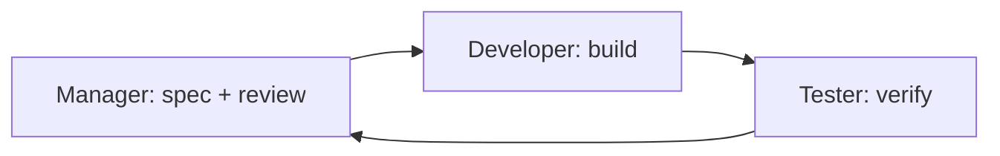

# PreVault Agentic Development Loop

Three agents collaborate on every feature cycle:

| Agent | File | Output |
|-------|------|--------|
| **Manager** | `.cursor/agents/manager.md` | Task spec, review approval |
| **Developer** | `.cursor/agents/developer.md` | Code, tests |
| **Tester** | `.cursor/agents/tester.md` | Test report, UX feedback |

## Cycle

1. **Manager** reads PLAN.md / TRACK.md → writes task + acceptance criteria.
2. **Developer** implements → runs `npm test` && `npm run build`.
3. **Tester** runs matrix in `tester.md` → PASS/FAIL report.
4. **Manager** reviews → updates TRACK.md → next task or ship.

## Current build

Full MVP PWA implemented in `src/` — local-first with demo auth; Supabase optional via `.env`.

Run: `npm install && npm run dev`
